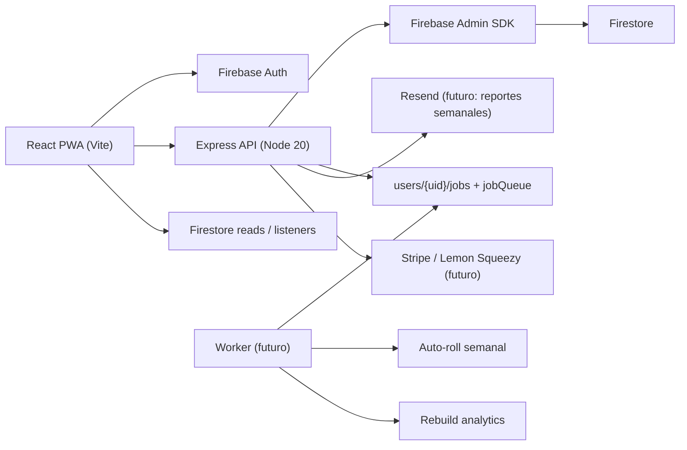

# Tech Stack And Scale Plan

Referencia para Daily Tracker y su evolucion como app hermana de la familia
finanzas-pro / Meteora.

## Objetivo

Producto SaaS de tracking de tareas semanal:

- Mobile-first para captura rapida de tareas y check de progreso.
- Densidad util en desktop (board horizontal con columnas por dia).
- Estado fluido: optimistic UI, listeners acotados.
- Multi-plataforma compartiendo logica via monorepo (web hoy, mobile RN despues).

El objetivo "wannabe" es evolucionar progresivamente hasta soportar 1M de
usuarios sin rehacer el producto desde cero. La regla principal: primero
blindar contratos, limites, observabilidad y costos; despues separar
infraestructura.

## Stack Actual

| Capa | Tecnologia | Uso |
| --- | --- | --- |
| Monorepo | npm workspaces | `packages/core`, `packages/web`, `packages/api`. |
| Frontend | React 18 | UI, rutas, contextos. |
| Frontend | TypeScript strict | Tipado de entidades, hooks, contratos. |
| Build | Vite 5 | Dev server (puerto 3005), build web, defines de version. |
| Estilos | Tailwind 3 + tokens en `core/theme.ts` | Dark mode, paleta. |
| Componentes | shadcn/ui (radix + cva) | Button, Dialog, DropdownMenu, Input, Tooltip. |
| Iconos | lucide-react | Iconografia toda la app. |
| Fechas | date-fns | weekId ISO (`2026-W22`), dayId (`2026-05-27`). |
| Estado | Zustand + immer | Store compartible con mobile. |
| Animacion | framer-motion | Transiciones de TaskCard. |
| Drag & Drop | @dnd-kit/core + sortable | Mover tareas entre dias (pendiente). |
| Graficos | recharts | Analytics (pendiente). |
| Auth | Firebase Auth | Google + Email/Password. |
| DB cliente | Firestore | Lecturas realtime acotadas. |
| Backend | Express + Node 20 | `packages/api` con Admin SDK. |
| Admin SDK | firebase-admin | Escrituras backend-owned, jobs, agregados. |
| Versionado | inyectado por Vite + `/api/version` | Por PR. |

## Contratos Importantes

- Las tareas se crean, editan y eliminan por backend: `POST/PATCH/DELETE /api/tasks`.
- Los proyectos se crean, editan y eliminan por backend: `POST/PATCH/DELETE /api/projects`.
- Los agregados semanales son backend-owned: `users/{uid}/analytics/{weekId}`.
- Los contadores de uso por plan: `users/{uid}/usage/{period}` (escrita por backend).
- Eventos idempotentes en `users/{uid}/usageEvents/{eventId}`.
- Jobs pesados en `users/{uid}/jobs/{jobId}` + `jobQueue/{jobId}` (auto-roll de tareas, rebuild de analytics).
- El cliente lee datos propios, las reglas Firestore bloquean escrituras que puedan saltarse plan limits.

## Arquitectura Actual



## Modelo De Datos

```text
users/{uid}/
  profile/data             -> { name, email, plan, createdAt, settings }
  projects/{projectId}     -> { name, color, icon, createdAt, order }
  weeks/{weekId}/          -> weekId: "2026-W22"
    days/{dayId}/          -> dayId: "2026-05-27"
      tasks/{taskId}       -> { title, completed, completedAt, projectId,
                                priority, notes, order, tags[], movedFrom,
                                createdAt, updatedAt }
  analytics/{weekId}       -> { completionsByDay, completionsByProject, streakCount }
  usage/{period}           -> { tasksCreated, projectsCreated, ... }      [backend-only]
  usageEvents/{eventId}    -> idempotente                                 [backend-only]
  jobs/{jobId}             -> { type, status, attempts, payload, result }

errorLogs/{logId}          -> { uid, severity, op, message, stack, meta, version, ua }
sitePresence/{uid}         -> { lastBeat, section, version }
siteSectionUsage/{period}/sections/{sectionId}
jobQueue/{jobId}           -> mirror para worker poller
webhookEvents/{provider_eventId}
```

## Estado De Escala Actual

| Area | Estado | Riesgo si crece |
| --- | --- | --- |
| Auth | Firebase Auth estable | Bajo. Revisar cuotas y dominios autorizados. |
| Firestore | Reglas estrictas (en construccion) | Medio. Evitar listeners amplios y collection scans. |
| API | Express unico | Medio. Escala vertical; rate limit in-memory. |
| Jobs | Por construir (Firestore queue + worker) | Medio. Esperado para auto-roll y analytics. |
| Rate limits | In-memory por proceso | Alto al escalar horizontalmente. |
| App Check | Hooks listos, no enforced | Medio. Activar en produccion. |
| Pagos | No implementado | N/A en beta. |
| Analytics | Heartbeat planificado | Medio. Para 100k+ conviene warehouse. |
| Backups | Pendiente formalizar | Alto antes de datos criticos. |

## Escala Wannabe A 1M Usuarios

### Fase 0: Beta controlada

- Backend monolitico.
- App Check listo para enforcement.
- Plan limits en backend (free: 3 proyectos, semana actual, sin analytics; pro: ilimitado).
- Jobs asincronos para auto-roll y rebuild de analytics.
- Admin con fallos, uso, usuarios activos, version y estado.
- Versionado obligatorio por PR.
- Backups manuales o programados basicos.

### Fase 1: 1k a 10k usuarios

- Activar App Check en produccion.
- Configurar alertas reales: Firebase, hosting, pagos.
- Pasar rate limiting a Redis o Firestore counters.
- Separar worker del web server.
- Dashboards de latencia, errores y costos.
- Runbook de rollback y restore.

### Fase 2: 10k a 100k usuarios

- Reemplazar `jobQueue` por Cloud Tasks o Pub/Sub.
- Reducir listeners realtime solo a superficies activas.
- Cache de API para datos estables (proyectos, profile).
- Tests de carga para endpoints de tasks, analytics y auto-roll.
- Pipelines de datos para analytics historico.

### Fase 3: 100k a 500k usuarios

- Separar dominios: billing, analytics, notifications, tasks.
- Event bus para eventos de usuario y pagos.
- Mantener Firestore para datos operativos user-scoped.
- Warehouse para analytics: BigQuery, ClickHouse.
- Feature flags y release channels: stable, beta, internal.

### Fase 4: 500k a 1M usuarios

- Arquitectura event-driven.
- CQRS para analytics y reporteria pesada.
- Colas gestionadas con DLQ.
- Observabilidad distribuida: traces, metrics, logs, SLOs.
- Multi-region solo si la latencia lo justifica.

## Tecnologias Wannabe Recomendadas

Mismas que finanzas-pro. Ver `D:\DesarrollosFF\finanzas-pro\docs\TECH_STACK_AND_SCALE.md`
seccion "Tecnologias Wannabe Recomendadas".

## Principios Para Apps Hermanas

- Empezar con monolito claro, pero con contratos backend para cualquier escritura sensible.
- Nunca confiar en limites implementados solo en frontend.
- Disenar datos por usuario primero: `users/{uid}/...`.
- Separar lecturas realtime de lecturas historicas.
- Enviar procesos caros a jobs desde el primer dia.
- Guardar version y canal en errores, analytics y estado del sistema.
- Admin basico desde beta: fallos, uso, estado, version.
- Documentar lo que todavia no escala; ocultarlo solo retrasa el problema.
